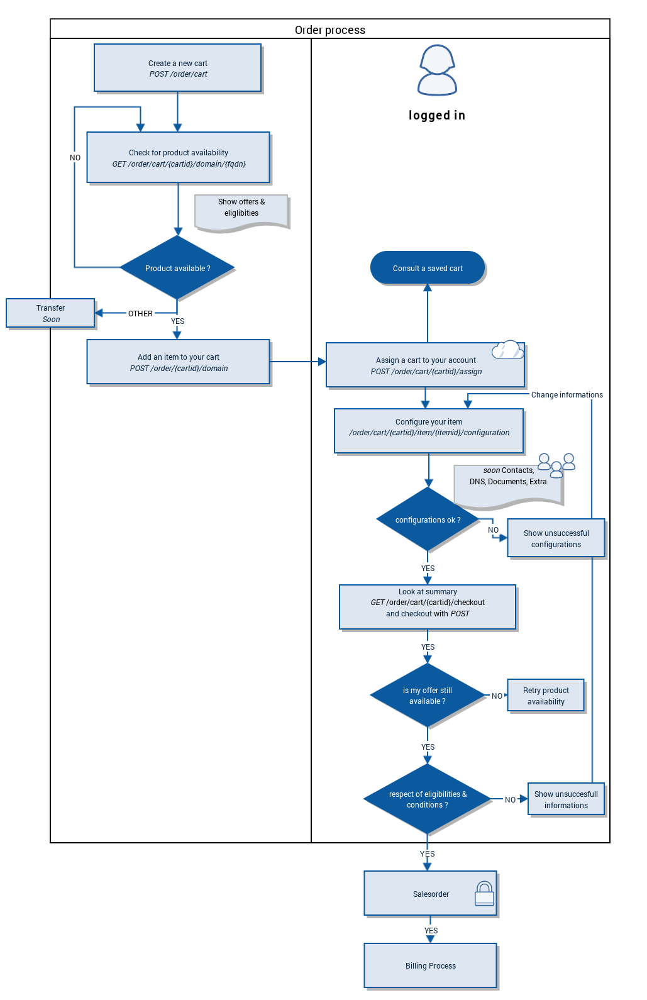

New [Order API](https://api.ovh.com/console/#/order/cart#POST), sample dedicated to domain names.

#Features

* Bulk product ordering(s)
* Fast order system
* Realtime update of prices and promotions
* Versioned releases, ensure backward compatibility
* Configuration management
* Python, PHP samples

# Order creation flow



## Prerequisites

Please take a look at [Python-OVH](https://github.com/ovh/python-ovh) for properly setting up your environment.

These examples assumes an existing configuration with valid ``application_key``, ``application_secret`` and ``consumer_key``..

# Getting Started

OK, show me the code !

## Order a product

At first, you should load the ovh python library,
this module assist you with security and token management on top of requests.

``` python
import ovh
client = ovh.Client()
```

### Create a cart

Cart is an util that will contain all products you choose to purchase.
It is close to a shopping cart in the mall.

Your cart will be saved for 1 day, after that it will desappear.
If you plan to delay your billing, setup a further datetime for `expire` parameter.
e.g.: `2015-12-24T01:00:00+00:00` (ISO 8601)

Moreover, developer could give a custom description, like: `merryChristmas`.

``` python
cart = client.post("/order/cart", ovhSubsidiary="FR", description="merryChristmas", _need_auth=False)
```

### Search for a product

Search for a given product from OVH catalog, here we look at domain names.

``` python
client.get("/order/cart/{0}/domain".format(cart.get("cartId")), domain="merrychristmas.ovh")
```

``` javascript
[
    {
        deliveryTime: ""
        offerId: "7555cdb9b1ffbe3447a9f865b56980ad"
        orderable: true
        productId: "domain"
        duration: [
            "P1Y"
        ]
        configurations: [ ]
        phase: "normal"
        quantityMax: 1
        prices: [
            {
                price: {
                    currencyCode: "EUR"
                    text: "2.99 €"
                    value: 2.99
                }
                label: "PRICE"
            },
            {
                price: {
                    currencyCode: "EUR"
                    text: "-2.00 €"
                    value: -2
                }
                label: "DISCOUNT"
            },
            {
                price: {
                    currencyCode: "EUR"
                    text: "0.00 €"
                    value: 0
                }
                label: "FEE"
            },
            {
                price: {
                    currencyCode: "EUR"
                    text: "2.99 €"
                    value: 2.99
                }
                label: "RENEW"
            },
            {
                price: {
                    currencyCode: "EUR"
                    text: "0.99 €"
                    value: 0.99
                }
                label: "TOTAL"
            }
        ]
    }
]
```

#### Useful informations:

`Orderable` pair displays the availablity of a product.

`Duration` pair shows you, how much time your service will be supplied.

`Prices` array, will give you interesting price indication.

### Add an item

Feel free to add new domain name in your cart, by posting on cart.

``` python
client.post("/order/cart/{0}/domain".format(cart.get("cartId")), domain="merrychristmas.ovh")
```

When multiple offers are available for the same product,
for example, when a domain name (like merrychristmas.corsica) has several offers.
You should select a given offer by filling an `offerId` parametrer : `f91eff066710facd6392190dfa8bb5ca`.
By default, the first offer will be taken.

### Bind a cart to your account

At this stage, it saves your cart into your account, this is useful if you are setting up
configuration or adding contacts and want to see other details later, without losing it.

``` python
client.post("/order/cart/{0}/assign".format(cart.get("cartId")))
```

Thanks to assign, when your are authentificated, you are now able to search your cart by description,
and modify its content.

``` python
client.get("/order/cart", description="merryChristmas")
```

### Configurations

You will be able to setup some configurations on your domain name during the order process.
Please take a look at [this guide](docs/configuration.en.md) for more informations.

### Let's checkout

This step generates an ovh sales-order ready to bill.
As a developer, you might be interest to run this as a dry run, to check if everything is fine.

``` python
salesorder = client.get("/order/cart/{0}/checkout".format(cart.get("cartId")))
```

And finally,

``` python
salesorder = client.post("/order/cart/{0}/checkout".format(cart.get("cartId")))
```

A sales-order URL will be displayed to continue your billing process.

### Automatisation of payment procedure

Once your cart has been checked out, you will be able to automate the payment of your sales-order.
This procedure requires that you had enough funds on your prepaid account (OVH account or fidelity account).

``` python
order = client.get("/me/order/{0}/availableRegisteredPaymentMean".format(salesorder.get("orderId")))
```

This API call will give you a list of the different payment means available for you to pay this order.
`null` value indicates that the order can't be paid with that payment mean.

Finally,
``` python
order = client.post("/me/order/{0}/payWithRegisteredPaymentMean".format(salesorder.get("orderId")))
```
payWithRegisteredPaymentMean enables you to validate your order with payment from a prepaid account.
The delivery of your order will start to be processed by our robots.


## Quick samples

### Search for a name on featured TLDs

``` python
import ovh
client = ovh.Client()

# retrieve all extension that you can order
extensions = client.get("/domain/data/extension", country="FR")

# creating a new cart
cart = client.post("/order/cart", ovhSubsidiary="FR")
domain = "MY-DOMAIN-NAME."

# get availability for featured extensions
for extension in extensions[0:10]:
    result = client.get("/order/cart/{}/domain".format(cart.get("cartId")), domain=domain+extension)
    if result[0].get("orderable"):
        print(domain+extension + " is available")
    else:
        print(domain+extension + " is NOT available")
```

### Glossary

- **Eligibility**: mandatory conditions or documents to order a product.

- **Offer** : a business plan for a dedicated product.

- **TLD** : Top Level domain, e.g: .COM, .FR.

- **Phase**: A phase is a special period when a limited group is able to register a given domain name.

- **Pair**: A pair is a Key Value field inside a JSON object {}.

### OVH Europe

- **Documentation**: https://github.com/ovh/order-cart-examples
- **Community support**: api-subscribe@ml.ovh.net
- **Console**: https://eu.api.ovh.com/console
- **Create application credentials**: https://eu.api.ovh.com/createApp/
- **Create script credentials** (all keys at once): https://eu.api.ovh.com/createToken/

## Related links

- **Contribute**: https://github.com/ovh/order-cart-examples
