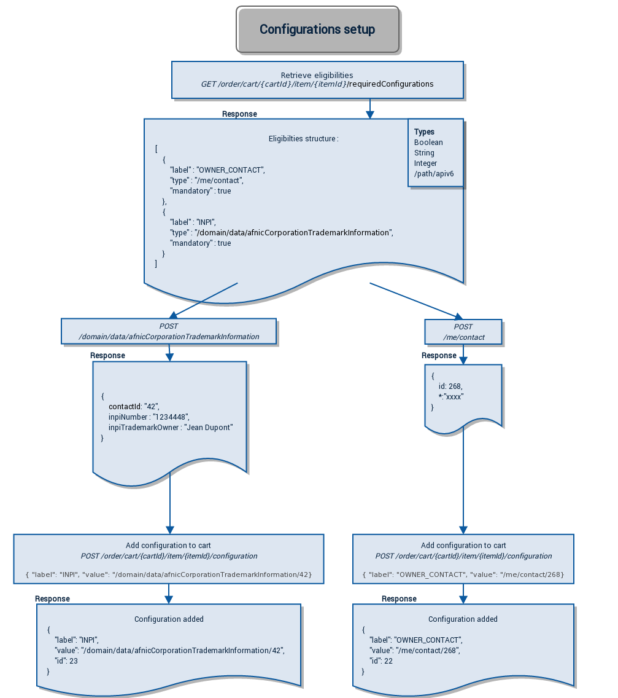

# Item configuration

## Introduction

In order to configure precisely the items in your cart before ordering, an item configuration system has been implemented. For example, when domain names products are put in the cart, configurations will give you the ability of personnalizing DNS servers or owner contacts before order completion.



## How it works

A cart item can be retrieved at this address : `GET /order/cart/{cartId}/item/{itemId}`.
We can also access to the configuration IDs of the cart item through : `GET /order/cart/{cartId}/item/{itemId}/configuration`.  
By default, no configuration is attached to the cart item when it has just been put in the shopping cart.

A configuration is a set by two elements: the label configuration and its value. The label identifies the context on which the value will be applied (for example, `DNS` label for a DNS entry, `OWNER_CONTACT` label in order to configure an owner contact, `ADMIN_ACCOUNT` label in order to configure the administrator account for the service, `TECH_ACCOUNT` label in order to configure the technical account for the service, `ACCEPT_CONDITIONS` label in order to validate special conditions for a domain name registration).

To get the list of all cart items valid configurations (including mandatories ones), call : `GET /order/cart/{cartId}/item/{itemId}/requiredConfiguration`.  
This call will return a list of the possible configurations, with the following information:

- _label_ : label for the configuration
- _type_ : type of the value for this configuration (see Types section of this guide)
- _fields_ : corresponding fields to be provided for the configuration (for complex types - see Types section of this guide)
- _required_ : indicates if the configuration is mandatory to proceed to checkout

To add a configuration, call the API method `POST /order/cart/{cartId}/item/{itemId}/configuration`, with the following parameters:

- in query URL:
  - _cartId_ : Cart Identifier
  - _itemId_ : Cart Item Identifier
- in the body, encoded with JSON format:
  - _label_ : Configuration label
  - _value_ : Configuration value

Once the configuration has been posted, an identifier associated to this configuration will be returned, and the data will be reachable at the following address : `GET /order/cart/{cartId}/item/{itemId}/configuration/{configurationId}`.


## Types

Several configuration types exist : 4 basics types and complex types.

The first four types are:

- Boolean
- Integer
- String
- Nichandle

---
#### Boolean

Represents a TRUE or FALSE value.

**Values accepted for this type :**

- "true"
- "false"

---
#### Integer

Represents a non decimal numerical value.

**Values accepted for this type :** all digits without commas or dots.

---
#### String

Represents a string value.

**Values accepted for this type :** all strings.

---
#### Nichandle

Represents an OVH account identifiant.

**Values accepted for this type :** all valid OVH account identifiant.

---
#### Complex types

Complex types are particular configurations requiring a value that can't be represented with simple boolean, integer, or string. Creation of these configurations will rely on others resources already available on APIv6.

For example, owner contact configuration for a domain name will require the last name, the first name, the address, etc. which will be represented by a complex type. Then, the required type for this configuration will be `/me/contact`, which corresponds to an APIv6 endpoint. The corresponding resource should be created (for this example, through `POST /me/contact`), and then post the configuration with a URL resource (allowing the access to the previously posted resource) as a value of the configuration (for example `/me/contact/1`).

If a new contact is created through `POST /me/contact`, the return value will contain an `id` field, and the information about this contact will be queriable through `GET /me/contact/{id}`. Then, the `OWNER_CONTACT` configuration shall created with the associated value `/me/contact/{id}`.

Then, all complex types will be represented like `/xyz`, which indicates the APIv6 path : they will always start with the following character `/` (it's an easy way to spot them).

##### Fields

The `fields` section returned by a call on `GET /order/cart/{cartId}/item/{itemId}/requiredConfiguration` (as mentioned earlier) will be used exclusively for complex types. It allows to indicate which properties is required during the resource creation.

For example, on a `/me/contact` configuration type, the value of `fields` could be: `["firstName", "lastName", "legalForm"]`. It means that during the contact creation operation (`POST /me/contact`) the fields `firstName`, `lastName`, and `legalForm` shall be specified in order to validate the configuration requirements.


## Examples

Let's present a small script to understand the whole configuration workflow. We will order a .FR domain name which requires an owner contact configuration.

```py
import ovh
import pprint
client = ovh.Client()

# cart creation
cart = client.post("/order/cart", ovhSubsidiary="FR")
client.post("/order/cart/{0}/assign".format(cart["cartId"]))

# availability check
domain_name = "lets-have-fun-with-order-api.fr"
domain_result = client.get("/order/cart/{0}/domain".format(cart["cartId"]), domain=domain_name)

if not domain_result or not domain_result[0]["orderable"]:
        raise Exception("Domain name unavailable")

item = client.post("/order/cart/{0}/domain".format(cart["cartId"]), domain=domain_name)

# here, we will retrieve all required configuration
configurations = client.get("/order/cart/{0}/item/{1}/requiredConfiguration".format(cart["cartId"], item["itemId"]))

for configuration in configurations:
        # owner contact configuration required
        if configuration["label"] == "OWNER_CONTACT" and configuration["type"] == "/me/contact" and configuration["required"]:
        # contact creation
                contact = client.post("/me/contact",
                        firstName="Jean",
                        lastName="Dupont",
                        legalForm="individual",
                        address={
                            "country": "FR",
                            "line1": "18 rue de Paris",
                            "city": "Paris",
                            "zip": "01000"},
                        language="fr_FR",
                        email="noreply@ovh.com",
                        phone="+33123456789",
                        birthDay="1980-01-01",
                        birthCountry="FR",
                        birthZip="75000",
                        birthCity="Paris")

                # posting the configuration
                configuration = client.post("/order/cart/{0}/item/{1}/configuration".format(cart["cartId"], item["itemId"]),
                        label="OWNER_CONTACT",
                        value="/me/contact/{0}".format(contact["id"]))

# cart validation
client.get("/order/cart/{0}/checkout".format(cart["cartId"]))

salesorder = client.post("/order/cart/{0}/checkout".format(cart["cartId"]))
print(u"Order #{0} ({1}) has been generated : {2}"
              .format(salesorder["orderId"],
                      salesorder["prices"]["withTax"]["text"],
                      salesorder["url"]))
```
